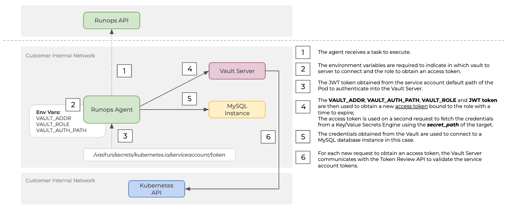

# Vault on Kubernetes - Static Secrets

This guide explain how to deploy an agent consuming secrets from a Vault Key/Value Secrets Engine authenticating in Vault using service account credentials from Kubernetes.



## Requirements

- Kubernetes Cluster / kubectl cli
- An active organization in Runops with admin access

## Install and Configure Vault

```sh
kubectl create ns vault-dev || true
kubectl create ns runops || true
kubectl apply -n vault-dev -f ./k8s
```

> **IMPORTANT:** this is a development instance of Vault, it shouldn't be used in production. [See this guide](https://www.vaultproject.io/docs/platform/k8s) explaining how to deploy a secure Vault instance on Kubernetes.

### Enable Kubernetes

The Kubernetes auth method can be used to authenticate with Vault using a Kubernetes Service Account Token. This method of authentication makes it easy to introduce a Vault token into a Kubernetes Pod.

```sh
kubectl exec -it -n vault-dev deploy/vault -- sh
export VAULT_TOKEN=vault-root-token
vault auth enable kubernetes
vault write auth/kubernetes/config \
  kubernetes_host="https://$KUBERNETES_PORT_443_TCP_ADDR:443" \
  token_reviewer_jwt="$(cat /var/run/secrets/kubernetes.io/serviceaccount/token)" \
  kubernetes_ca_cert=@/var/run/secrets/kubernetes.io/serviceaccount/ca.crt \
  issuer="https://kubernetes.default.svc.cluster.local"
```

> Be aware that the JWT token of token_reviewer_jwt could be rotated by Kubernetes, if this happens Vault will not be able to validate tokens from service accounts.

### Add a policy

```sh
vault policy write mysqldev - <<EOF
path "secret/data/mysqldev/credentials" {
  capabilities = ["read"]
}
EOF

vault write auth/kubernetes/role/mysqldev \
    bound_service_account_names=default \
    bound_service_account_namespaces=runops \
    policies=mysqldev \
    ttl=24h
```

## MySQL Install / Configuration

Deploy a MySQL instance and configure the root credentials inside a path

```sh
kubectl -n runops apply -f ../kubernetes/mysql-deploy.yaml
kubectl exec -it -n vault-dev deploy/vault -- sh
export VAULT_TOKEN=vault-root-token
vault kv put secret/mysqldev/credentials \
    MYSQL_HOST=mysql.runops \
    MYSQL_PASS=1a2b3c4d \
    MYSQL_DB=testdb \
    MYSQL_USER=root
```

## Deploy Runops Agent

```sh
# TODO: change to tarball
# TODO: change tags to test
# TODO: remove image option
helm upgrade --install agent ./ \
  --set image.tag=latest \
  --set config.tags=gcp \
  --set config.token=f303e17a3268ecbf4f0c010da4ecc47298d254b542fe1103 \
  --set config.vault.addr=http://server.vault-dev:8200 \
  --set config.vault.role=mysqldev \
  --namespace runops

runops targets create \
  --name mysql-vault \
  --type mysql \
  --secret_provider hashicorp/kv \
  --secret_path secret/data/mysqldev/credentials \
  --tags gcp

runops tasks create -t mysql-vault -s 'SELECT NOW()'
```

## References

- https://www.vaultproject.io/docs/platform/k8s
- https://learn.hashicorp.com/tutorials/vault/static-secrets
- https://www.vaultproject.io/docs/auth/kubernetes
